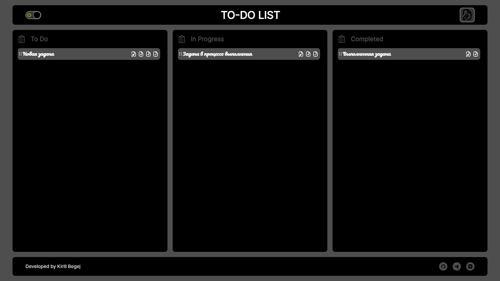

# Проект "To-Do List" – Менеджер задач с Drag-and-Drop

## О проекте

**To-Do List** — это одностраничное приложение для управления задачами. Пользователь может создавать, редактировать, удалять задачи, а также перемещать их между тремя статусами: "To Do", "In Progress" и "Completed" с помощью технологии Drag and Drop. Все данные сохраняются в `Local Storage`, что обеспечивает сохранность задач даже при перезагрузке страницы. Проект построен по принципам ООП и использует сборщик Webpack.

## Превью проекта




## Ссылка на демо

- [Посмотреть сайт](https://todo-list-project-two-red.vercel.app/)

## Статус проекта

Проект завершён.

## Функциональность

- **Создание задач**: Возможность добавления новых задач через всплывающее окно.
- **Редактирование задач**: Внесение изменений в уже созданные задачи.
- **Удаление задач**: Быстрое удаление ненужных задач.
- **Сортировка задач**: Задачи можно перетаскивать между категориями "To Do", "In Progress" и "Completed".
- **Сохранение данных**: Все изменения сохраняются в `Local Storage`.
- **Переключение темы**: Светлая и тёмная тема интерфейса.
- **Адаптивная вёрстка**: Интерфейс адаптирован под различные размеры экрана.

## Технологии и инструменты

- **HTML5** — Семантическая структура страницы.
- **CSS3 / SCSS** — Стилизация и вложенность стилей.
- **БЭМ** — Методология организации CSS-классов.
- **JavaScript (ES6+)** — Логика приложения, ООП-подход.
- **Drag and Drop API** — Реализация перемещения задач между колонками.
- **Webpack** — Сборка проекта.
- **ESLint + Stylelint** — Линтинг кода по стандартам airbnb и stylelint-config-standard.

## Запуск проекта

1. Клонируйте репозиторий:

   ```bash
   git clone https://github.com/kirill-io/todo-list-project.git
   ```

2. Перейдите в директорию проекта::

   ```bash
   cd todo-list-project
   ```

3. Установите зависимости::

   ```bash
   npm install
   ```

4. Запустите проект в режиме разработки:

   ```bash
   npm run start
   ```

5. Для сборки проекта:
  
  - Режим разработки:
    ```bash
    npm run build:dev
    ```

  - Production-сборка:
    ```bash
    nnpm run build:prod
    ```

## Проверка кода

Для проверки качества кода используются следующие инструменты:

- ESLint (airbnb-base) — Проверка JavaScript:
    ```bash
    npm run lint:js
    npm run lint:js:fix 
    ```

- Stylelint (scss) — Проверка стилей:
    ```bash
    npm run lint:scss
    npm run lint:scss:fix
    ```
